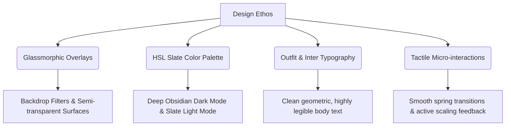

# 🛒 Online Tech — Premium E-Commerce Platform

[](https://angular.io/)
[](https://tailwindcss.com/)
[](https://expressjs.com/)
[](https://angular.io/guide/ssr)

A high-performance, modern, and SEO-optimized E-Commerce platform tailored for premium tech gadgets. Built using the latest **Angular 21** framework (standalone architecture, Signals reactivity, and hybrid hydration), styled with **Tailwind CSS v4**, and server-side rendered (SSR) via a unified **Express.js** engine.

---

## 🛠️ 1. Tech Stack

Our stack is carefully selected to deliver sub-second page loads, modular extensibility, and a fluid, application-like user experience.

### Frontend Core & Reactivity
*   **Angular 21**: Leveraging modern Angular design patterns including fine-grained reactivity using **Angular Signals**, standalone components, compile-time control flow (`@if` / `@for`), and lazy-loaded routes.
*   **RxJS**: Reactive streams and state-management for handling asynchronous events, API integrations, and search flows.
*   **Motion**: Powering page transitions, layout adjustments, and rich micro-interactions (e.g., active element scaling).

### Styling & Layout
*   **Tailwind CSS v4**: Leveraging the new PostCSS-based compiler and CSS `@theme` configuration for utility-first styling.
*   **Angular Material**: Integrating Material Design symbols and core layouts (`@angular/material`, `@angular/cdk`) to maintain component consistency.
*   **CSS Variables Custom Theme Engine**: Complete light/dark mode configuration driven by HSL colors (`slate` palettes) and dynamic transition curves.

### Backend, Server-Side Rendering (SSR) & APIs
*   **Express.js (SSR Node Server)**: Seamlessly rendering views on the server to optimize the First Contentful Paint (FCP) and metadata accessibility for search crawlers.
*   **DummyJSON Integration**: Fetching mock products, categories, search queries, and authorization assets from a mock backend.
*   **Google GenAI (`@google/genai`)**: Pre-configured structure for server-side Gemini AI integration to enable smart product recommendations and conversational assistance.

### Tooling & Infrastructure
*   **Vitest**: Fast unit-testing framework with a modern CLI.
*   **ESLint**: Strict static analysis configured for TypeScript and Angular styles (`eslint-plugin-angular`).
*   **Vite**: Behind-the-scenes build acceleration during bundling and hot module replacement (HMR).

---

## 📂 2. Repository Architecture

The project adheres to a clean, scalable folder layout that separates structural configuration, shared presentation, and business domains.

```bash
E-Commerce--Online-Tech/
├── .angular/                     # Angular CLI build cache
├── assets/                       # Global images, SVGs, and brand assets
├── public/                       # Static public assets served directly by Express
├── src/
│   ├── app/                      # Main client application
│   │   ├── core/                 # Singleton services, security, and models
│   │   │   ├── guards/           # Route guards (auth, roles protection)
│   │   │   ├── interceptors/     # Http traffic pipelines (e.g. error handling)
│   │   │   ├── models/           # Strongly typed data contracts (Product, User)
│   │   │   └── services/         # Business logic & APIs (Auth, Cart, API, Theme)
│   │   ├── features/             # Feature modules (Domain-driven page roots)
│   │   │   ├── admin/            # Role-protected administration dashboards
│   │   │   ├── auth/             # Login, registration, forgot-password forms
│   │   │   ├── cart/             # Cart details, quantity updates
│   │   │   ├── checkout/         # Order confirmation & checkout pages
│   │   │   ├── home/             # Landing page with heroes and trust banners
│   │   │   ├── shop/             # Product catalog, grid filters, search
│   │   │   └── wishlist/         # Saved items list
│   │   ├── shared/               # Globally reusable presentational units
│   │   │   └── components/       # Header, Footer, Product Cards
│   │   ├── app.config.ts         # Client routing, server configuration, and providers
│   │   ├── app.routes.ts         # Declarative routing map with lazy-loading components
│   │   ├── app.ts                # Application root shell component
│   │   └── app.css               # Core component layout adjustments
│   ├── main.server.ts            # SSR bundle entry point
│   ├── main.ts                   # Client compilation entry point
│   ├── server.ts                 # Express Server handling SSR and static middleware
│   └── styles.css                # Global stylesheet (Tailwind v4 base and custom classes)
├── angular.json                  # Workspace build parameters and environments
├── package.json                  # Dependencies & execution scripts
└── tsconfig.json                 # TypeScript compiler configuration
```

### Architecture Design Principles
1.  **Strict Layering (Unidirectional Dependency Flow)**: `features` are allowed to consume services from `core` and components from `shared`, but they cannot cross-import each other.
2.  **State Isolation**: Local state is maintained using Angular Signals. Shared states (e.g., Cart count, Theme mode, User session) are managed via singleton core services (`CartService`, `ThemeService`, `AuthService`).
3.  **Route-Level Lazy Loading**: Every page under `features` is lazily loaded via router configuration to ensure minimal bundle sizes for landing routes.

---

## 🎨 3. Designs and Inspirations

The application interface is crafted to evoke a premium, consumer-electronics aesthetic reminiscent of modern industry leaders.



### Aesthetic Features
*   **Obsidian Dark Mode & Ice Light Mode**: Tailored HSL color combinations to offer a striking appearance. Dark mode leverages `#07111F` to `#13263A` gradients to avoid flat blacks, while light mode uses a soft slate background (`#F8FAFC`) to minimize eye strain.
*   **Glassmorphism**: Header elements utilize a native blur backdrop (`backdrop-filter: blur(12px)`) blended with a semi-transparent surface, keeping the scroll experience immersive.
*   **Tactile Feedback**: Interactive components and buttons use responsive scale modifications (`active:scale-95`) and hover transition curves to give an organic, high-end feel.
*   **Inter Typography**: Clean, high-legibility sans-serif fonts combined with uppercase letter spacing are used on subheadings to mirror high-end electronics interfaces like *Apple*, *Stripe*, and *Linear*.

---

## 🚀 4. Infrastructure & Deployment Setup

### Environment Variables
Create a `.env` file in the root directory based on the `.env.example`:

```bash
# GEMINI_API_KEY: Configures connection to Gemini Large Language Models.
GEMINI_API_KEY="YOUR_API_KEY"

# APP_URL: The self-referential production deployment domain.
APP_URL="http://localhost:4000"
```

### Quick Start Guide

#### Prerequisites
*   Node.js (v18.x or above)
*   npm (v10.x or above)

#### 1. Install dependencies
```bash
npm install
```

#### 2. Start the Development Server
Runs the client application locally on port `3000` with Live Reload.
```bash
npm run dev
```

#### 3. Run Tests & Lints
Validate changes using the Vitest runner and ESLint rules.
```bash
# Run unit tests
npm run test

# Run linter
npm run lint
```

#### 4. Build and Run Server-Side Rendering (SSR)
To compile a production bundle and run the server on port `4000`:
```bash
# Build the production static client files and the SSR server bundle
npm run build

# Start the Express server
npm run serve:ssr:app
```
